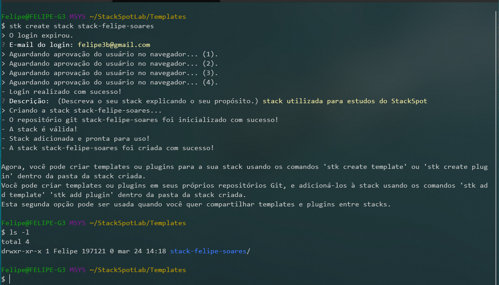
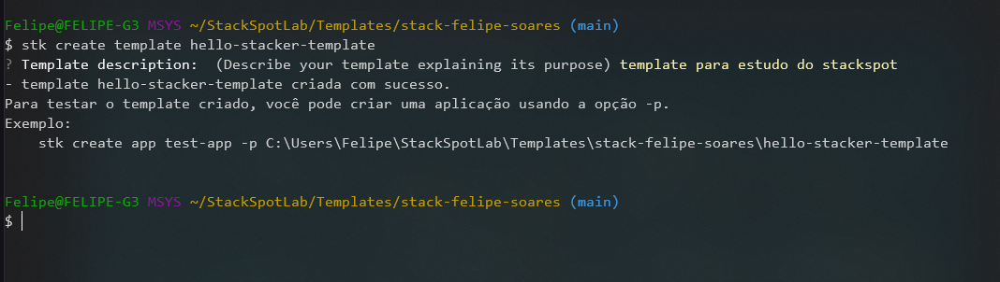
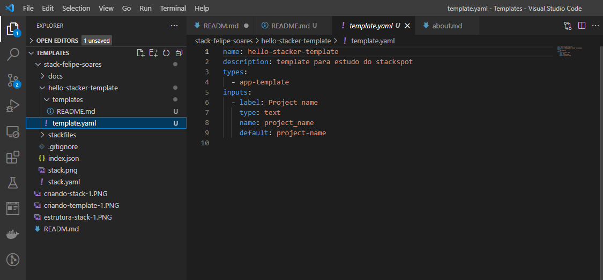
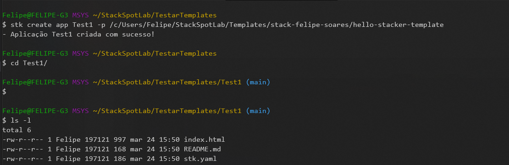
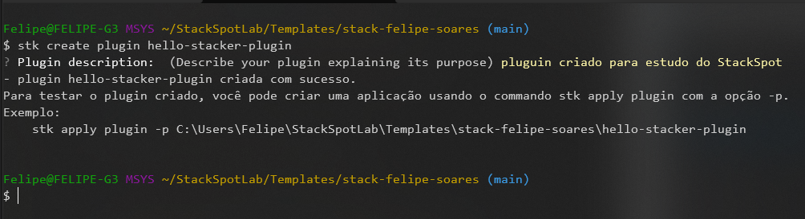
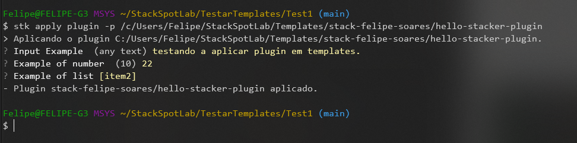
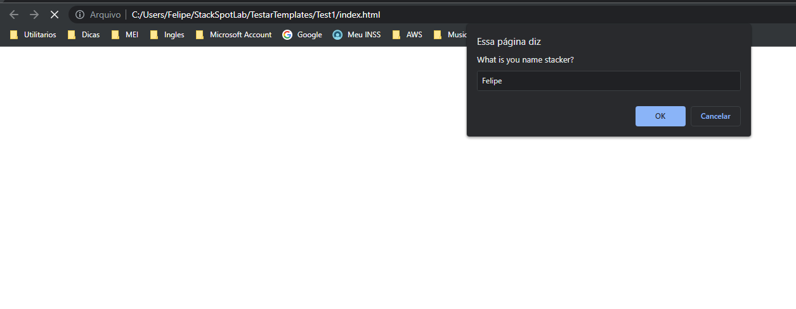
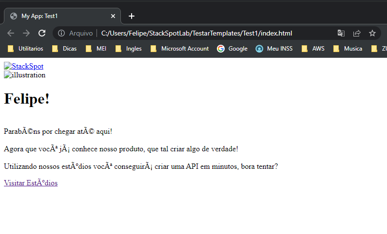

# StackSpot

A StackSpot é uma plataforma que oferece um conjunto de ferramentas, cujo objetivo é permitir que desenvolvedores e grandes empresas acelerem a sua produção de software. Além disso, também disponibiliza instrumentos para você publicar em uma Cloud de forma menos complicada.

- [O que é a StackSpot?, Para quem a StackSpot foi criada?, Para quem a StackSpot foi criada? .](https://docs.stackspot.com/docs/getting-started/how-it-works/)

Para inicar precisamos estruturar um projeto, nele vamos definir nosso codigo/conteudo separado por funções, o "Template" que sera a base, e depois os "Pluguins" que serão nossas funcionalidades que podem ser adicionadoss ao template dando a ele mais poderes :muscle: :muscle: :muscle:.

- [Clique aqui para verificar a documentação.](https://docs.stackspot.com/docs/create-stacks/quickstart/)

## 1. Criar Stack

  ```bash
  stk create stack <nome-da-stack-que-será-criada>
  ```
  
  
  
  > Na imagem acima temos um exemplo de criação de uma Stack, onde podemos começar a criar templates e pluguins dentro dela :clap:.
  
  
  
  
  > A imagem acima mostra como ficou a estrutura da Stack :clap:.

## 2. Criar Template

  ```bash
  stk create template <TEXTO-COM-O-NOME-DO-TEMPLATE>
  ```
  
  
  
  
  > Na imagem acima temos um exemplo de criação de uma Template :clap:.
  
  
  
  > A imagem acima mostra como ficou a estrutura da Stack :clap:.

## 3. Testando Template

  ```bash
  stk create app <TEXTO-COM-O-NOME-DO-APP> -p <TEXTO-COM-O-CAMINHO-DA-PASTA-DO-TEMPLATE>
  ```
  
  
  
  
  > Na imagem acima temos um exemplo de criação de uma Template :clap:.

## 4. Criar pluguins

  ```bash
  stk create plugin <TEXTO-COM-O-NOME-DO-PLUGIN>
  ```
  
  
  
  > Na imagem acima temos um exemplo de criação de uma Pluguin :clap:.

## 5. Aplicando Plugin no Template

  ```bash
  stk apply plugin -p <TEXTO-COM-O-CAMINHO-DA-PASTA-DO-PLUGIN>
  ```
  
  

## 6. Testando Template com Plugin


  
  
  
  > Nas imagens acima SUCESSO❕❕❕ 😎. Ao menos se for carioca 😂😂😂.

- [emojis github :metal: :metal: :metal:](https://github.com/hideraldus13/github-emoji)
