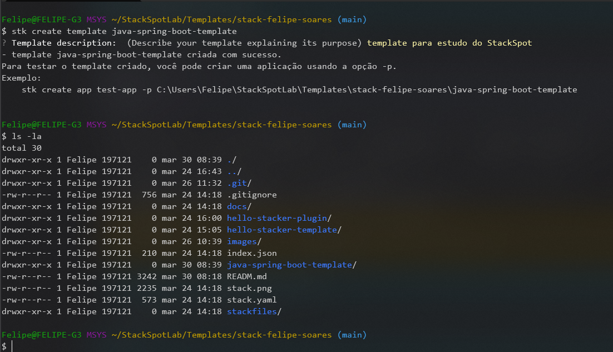
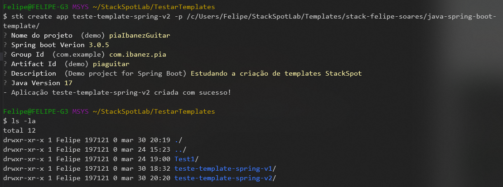
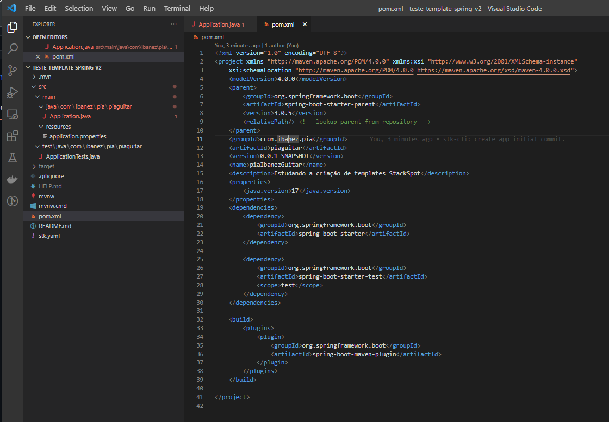

# StackSpot

A StackSpot é uma plataforma que oferece um conjunto de ferramentas, cujo objetivo é permitir que desenvolvedores e grandes empresas acelerem a sua produção de software. Além disso, também disponibiliza instrumentos para você publicar em uma Cloud de forma menos complicada.

- [O que é a StackSpot?, Para quem a StackSpot foi criada?, Para quem a StackSpot foi criada? .](https://docs.stackspot.com/docs/getting-started/how-it-works/)

Para inicar precisamos estruturar um projeto, nele vamos definir nosso codigo/conteudo separado por funções, o "Template" que sera a base, e depois os "Pluguins" que serão nossas funcionalidades que podem ser adicionadoss ao template dando a ele mais poderes :muscle: :muscle: :muscle:.

- [Clique aqui para verificar a documentação.](https://docs.stackspot.com/docs/create-stacks/quickstart/)

## 1. Criar Stack

  ```bash
  stk create stack <nome-da-stack-que-será-criada>
  ```
  
  
  
  > Na imagem acima temos um exemplo de criação de uma Stack, onde podemos começar a criar templates e pluguins dentro dela :clap:.
  
  
  
  
  > A imagem acima mostra como ficou a estrutura da Stack :clap:.

## 2. Criar Template

  ```bash
  stk create template <TEXTO-COM-O-NOME-DO-TEMPLATE>
  ```
  
  
  
  
  > Na imagem acima temos um exemplo de criação de uma Template :clap:.
  
  
  
  > A imagem acima mostra como ficou a estrutura da Stack :clap:.

## 3. Testando Template

  ```bash
  stk create app <TEXTO-COM-O-NOME-DO-APP> -p <TEXTO-COM-O-CAMINHO-DA-PASTA-DO-TEMPLATE>
  ```
  
  
  
  
  > Na imagem acima temos um exemplo de criação de uma Template :clap:.

## 4. Criar pluguins

  ```bash
  stk create plugin <TEXTO-COM-O-NOME-DO-PLUGIN>
  ```
  
  
  
  > Na imagem acima temos um exemplo de criação de uma Pluguin :clap:.

## 5. Aplicando Plugin no Template

  ```bash
  stk apply plugin -p <TEXTO-COM-O-CAMINHO-DA-PASTA-DO-PLUGIN>
  ```
  
  

## 6. Testando Template com Plugin


  
  
  
  > Nas imagens acima SUCESSO❕❕❕ 😎. Ao menos se for carioca 😂😂😂.

- [emojis github :metal: :metal: :metal:](https://github.com/hideraldus13/github-emoji)


# Craindo template com Java + Spring Boot

## 1. Criando Template

Vamos definir os [inputs do template](https://docs.stackspot.com/docs/create-stacks/yaml-files/inputs/);

- **spring_boot_version**: 2.3.1.RELEASE
- **group_id**: com.stackspot
- **artifact_id**: stackspot
- **description**: StackSpot
- **package_name**: com.stackspot.stackspot
- **packaging**: jar
- **java_version**: 11


 Comando para criar template

  ```bash
  stk create template java-spring-boot-template
  ``` 



Vamos utilizar o [spring initializer](https://start.spring.io/) para gerar uma projeto que vamos utilizar como base para o nosso template.


Após gerar o projeto, vamos copiar o conteudo da pasta gerada para a pasta do template.


Agora vamos configurar o arquivo [template.yaml](https://docs.stackspot.com/docs/create-stacks/yaml-files/template/), que é o arquivo que vai definir o que o template vai fazer.

```yaml
name: java-spring-boot-template
description: Template para criação de projetos Java + Spring Boot
inputs:
  - name: spring_boot_version
    type: string
    default: 2.3.1.RELEASE
  - name: group_id
    type: string
    default: com.stackspot
  - name: artifact_id
    type: string
    default: stackspot
  - name: description
    type: string
    default: StackSpot
  - name: package_name
    type: string
    default: com.stackspot.stackspot
  - name: packaging
    type: string
    default: jar
  - name: java_version
    type: string
    default: 11
```

```yaml

## 2. Testando Template

Com o template criado, vamos testar se ele esta funcionando.

  ```bash
  stk create app java-spring-boot-app -p java-spring-boot-template
  ```






[Voltar ao inicio!!](#stackspot)