# StackSpot

A StackSpot é uma plataforma que oferece um conjunto de ferramentas, cujo objetivo é permitir que desenvolvedores e grandes empresas acelerem a sua produção de software. Além disso, também disponibiliza instrumentos para você publicar em uma Cloud de forma menos complicada.

- [O que é a StackSpot?, Para quem a StackSpot foi criada?, Para quem a StackSpot foi criada? .](https://docs.stackspot.com/docs/getting-started/how-it-works/)

Para inicar precisamos estruturar um projeto, nele vamos definir nosso codigo/conteudo separado por funções, o "Template" que sera a base, e depois os "Pluguins" que serão nossas funcionalidades que podem ser adicionadoss ao template dando a ele mais poderes :muscle: :muscle: :muscle:.

- [Clique aqui para verificar a documentação.](https://docs.stackspot.com/docs/create-stacks/quickstart/)

## 1. Criar Stack

  ```bash
  stk create stack <nome-da-stack-que-será-criada>
  ```
  
  
  
  > Na imagem acima temos um exemplo de criação de uma Stack, onde podemos começar a criar templates e pluguins dentro dela :clap:.
  
  
  
  
  > A imagem acima mostra como ficou a estrutura da Stack :clap:.

## 2. Criar Template

  ```bash
  stk create template <TEXTO-COM-O-NOME-DO-TEMPLATE>
  ```
  
  
  
  
  > Na imagem acima temos um exemplo de criação de uma Template :clap:.
  
  
  
  > A imagem acima mostra como ficou a estrutura da Stack :clap:.

## 3. Testando Template

  ```bash
  stk create app <TEXTO-COM-O-NOME-DO-APP> -p <TEXTO-COM-O-CAMINHO-DA-PASTA-DO-TEMPLATE>
  ```
  
  
  
  
  > Na imagem acima temos um exemplo de criação de uma Template :clap:.

## 4. Criar pluguins

  ```bash
  stk create plugin <TEXTO-COM-O-NOME-DO-PLUGIN>
  ```
  
  
  
  > Na imagem acima temos um exemplo de criação de uma Pluguin :clap:.

## 5. Aplicando Plugin no Template

  ```bash
  stk apply plugin -p <TEXTO-COM-O-CAMINHO-DA-PASTA-DO-PLUGIN>
  ```
  
  

## 6. Testando Template com Plugin


  
  
  
  > Nas imagens acima SUCESSO❕❕❕ 😎. Ao menos se for carioca 😂😂😂.

# Craindo template com Java + Spring Boot

## 1. Criando Template

Vamos definir os [parametros de entrada do template](https://docs.stackspot.com/docs/create-stacks/yaml-files/inputs/)

- **Nome do projeto**
- **Versão do Spring Boot**
- **ID do Grupo**
- **ID do Artefato**
- **Descrição do Projeto**
- **Versão do Java**


 Com os parametros definidos vamos criar nosso [Template](https://docs.stackspot.com/docs/stk-cli/commands/commands-list/templates/stk-create-template/)

  ```bash
  stk create template <TEXTO-COM-O-NOME-DO-TEMPLATE>
  ``` 

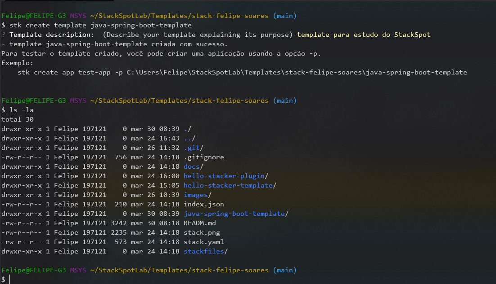

Vamos utilizar o [spring initializer](https://start.spring.io/) para gerar a estrutura que vamos utilizar como base para o nosso template.

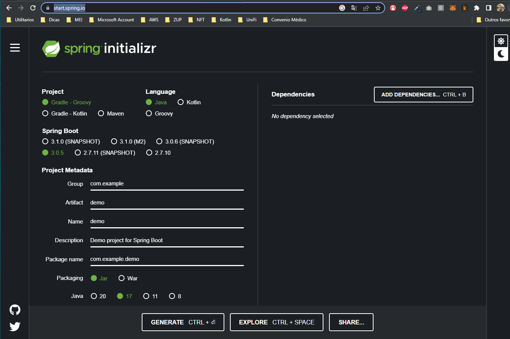

Após escolher as opções deseja clique em **GENERATE**, ira iniciar o download de um arquivo ZIP, depois extraia o conteudo para a pasta do template.

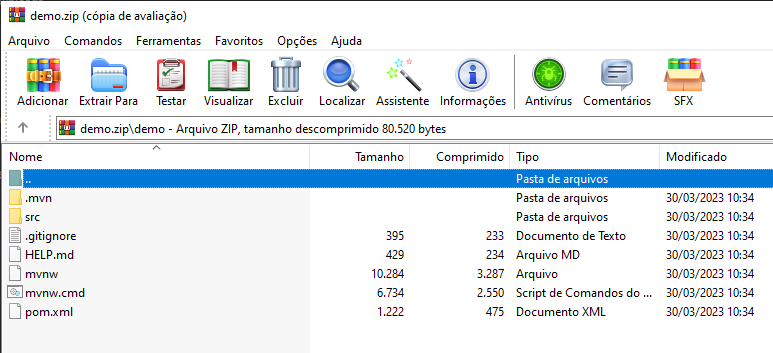

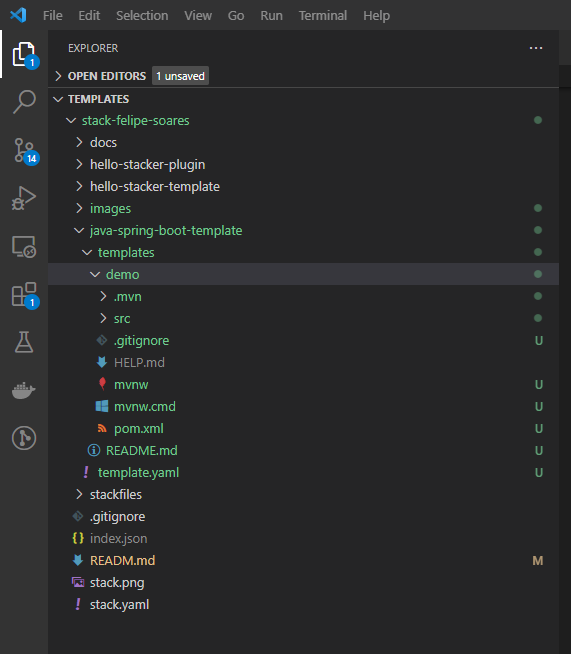

Agora vamos editar o arquivo [template.yaml](https://docs.stackspot.com/docs/create-stacks/yaml-files/template/), é nele que configuramos os parâmetros de entrada do Template que definimos anteriormente.

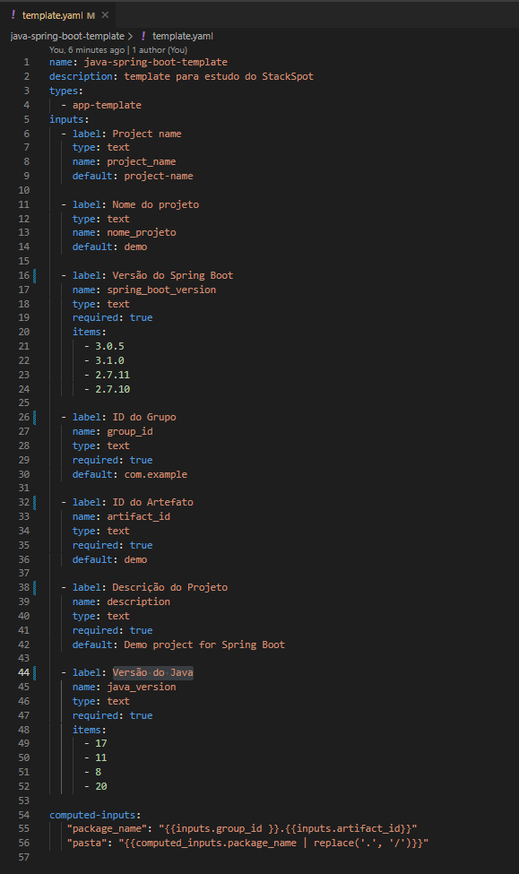

Agora vamos substituir os valores da estrutura que criamos pelos parametros que definimos no template.yml para que sejam materializados na hora da criação do projeto.

No pom.xml vamos inserir os parametros;

- spring_boot_version
- group_id
- artifact_id
- nome_projeto
- descricao_projeto
- java_version

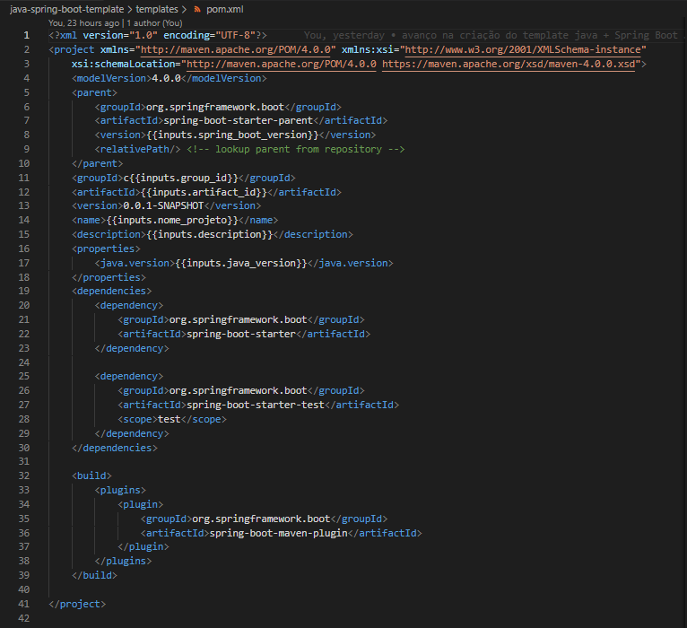

Para criar a estrutura de pastas do projeto vamos utilizar o **[computed-inputs](https://docs.stackspot.com/docs/create-stacks/yaml-files/advanced-inputs/)** , nele podemos manipular os parametros de entrada para criar novos.

Primeiro vamos criar um novo parametro chamado ***package_name*** que vai receber o valor do ***group_id*** mais o ***artifact_id***.

Depois criar o parametro ***pasta*** que vai receber o valor do ***package_name*** com os pontos substituidos por barras, conforme podemos ver no arquivo template.yml

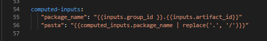

Agora na estrutura de pastas vamos nomear com o nome do parametro ***pasta*** conforme mostrado na imagem abaixo.

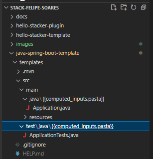
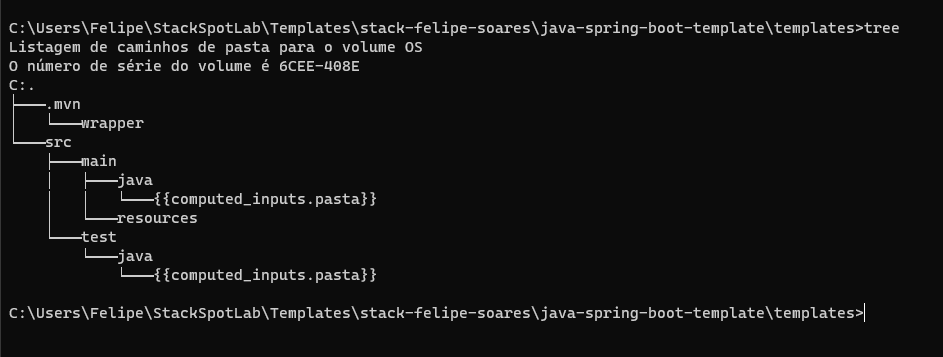

## 2. Testando Template

Com o template criado, vamos testar se está tudo funcionando.

  ```bash
  stk create app <TEXTO-COM-O-NOME-DO-APP> -p <PATH-DO-TEMPLATE>
  ```

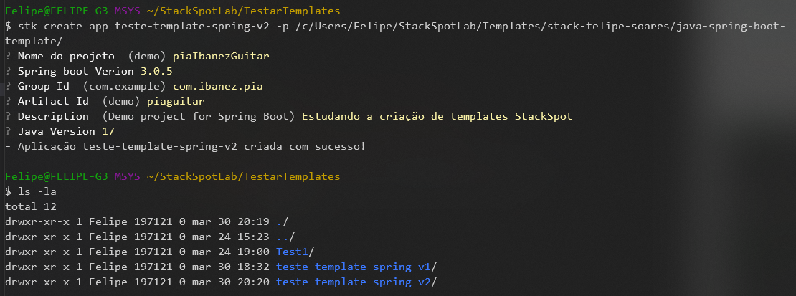

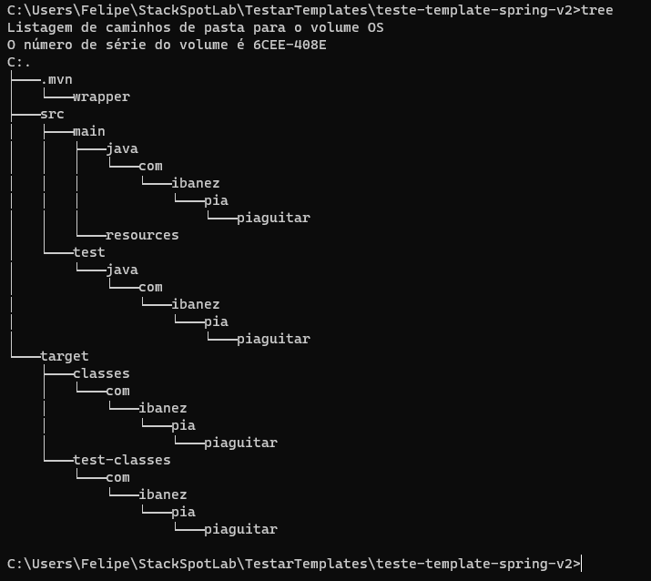

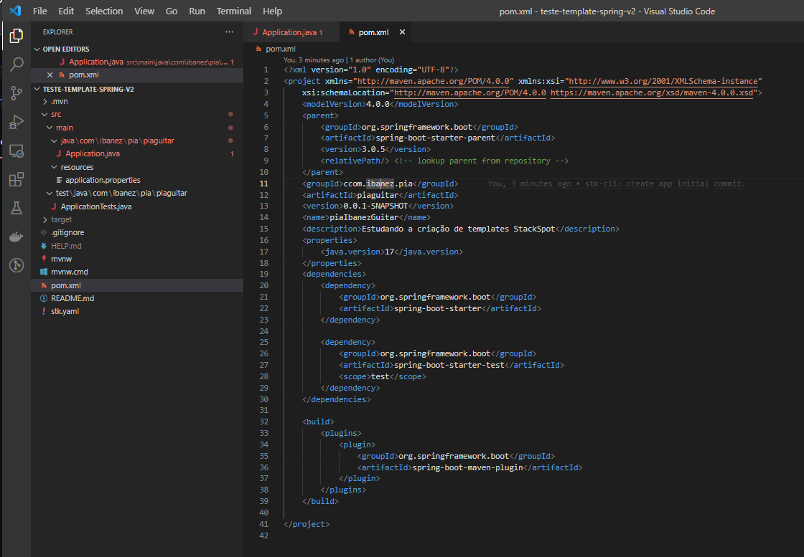


- [emojis github :metal: :metal: :metal:](https://github.com/hideraldus13/github-emoji)

[Voltar ao inicio!!](#stackspot)

# Criando plugin